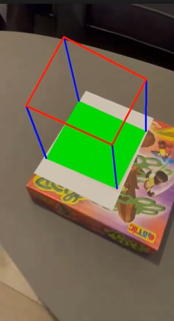
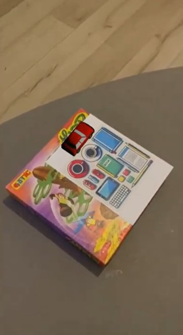

# Augmented Reality Project - Computer Vision

## Overview
This project is an augmented reality (AR) implementation using computer vision techniques. It involves perspective warping and planar AR object placement using OpenCV and related libraries.

## Project Structure

### **Python Scripts**
- **`planar_AR_Cube.py`** - Implements planar AR cube placement on detected markers.
- **`perspective_warping.py`** - Performs perspective transformation to align and modify image views.
- **`Planar_AR_Car.py`** - Implements AR car rendering using projection techniques.


## Demo Videos & Images
### **Video Demonstrations**
[▶️ Watch the AR Cube Demo](https://drive.google.com/file/d/1BkVViR9lLRjD3C1lXbsCDbUTZCF4ifTK/view?usp=sharing)

[▶️ Watch the AR Car Projection](https://drive.google.com/file/d/1f1t_kXFwG7kL4KJccbEmRomH18wdmobJ/view?usp=sharing)

### **Sample Images**
#### 📷 AR Cube Example:


#### 📷 AR Car Projection:


## Dependencies
Make sure to install the necessary dependencies before running the scripts:
```bash
pip install numpy opencv-python trimesh pyrender
